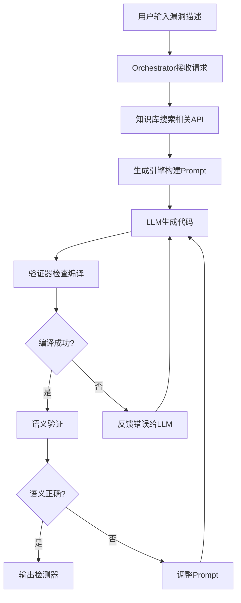
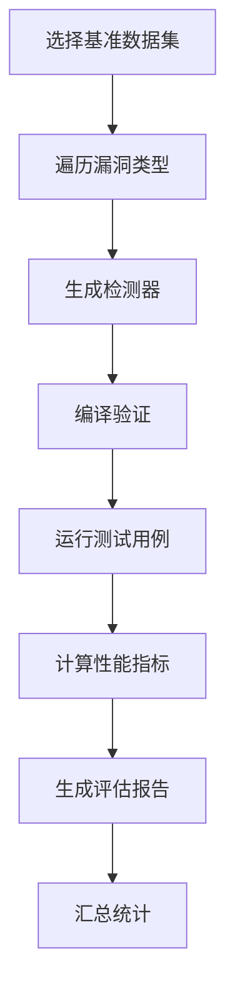

# LLM-Native框架架构设计

## 概述

LLM-Native是一个基于大语言模型的静态分析检测器自动生成框架，借鉴了IRIS和KNighter项目的优秀设计，专门针对学术研究和工业应用场景优化。

## 核心架构

### 1. 分层架构设计

```
┌─────────────────────────────────────┐
│           用户接口层                │
│  ┌─────────────────────────────────┐ │
│  │    CLI界面 (main.py)          │ │
│  │    REST API (api.py)          │ │
│  └─────────────────────────────────┘ │
└─────────────────────────────────────┘
                │
┌─────────────────────────────────────┐
│         编排调度层                  │
│  ┌─────────────────────────────────┐ │
│  │  Orchestrator (协同编排引擎)    │ │
│  └─────────────────────────────────┘ │
└─────────────────────────────────────┘
                │
┌─────────────────────────────────────┐
│         核心处理层                  │
│  ┌─────┬─────┬─────┬─────┬─────┐   │
│  │ 知识 │ 生成 │ 验证 │ 评估 │ 配置 │   │
│  │ 库管 │ 引擎 │ 器   │ 器   │ 管理 │   │
│  │ 理器 │     │     │     │     │   │
│  └─────┴─────┴─────┴─────┴─────┘   │
└─────────────────────────────────────┘
                │
┌─────────────────────────────────────┐
│         基础设施层                  │
│  ┌─────┬─────┬─────┬─────┐         │
│  │ LLM │ 向量 │ 文件 │ 日志 │         │
│  │ 客户端│ 数据库│ 系统 │ 系统 │         │
│  └─────┴─────┴─────┴─────┘         │
└─────────────────────────────────────┘
```

### 2. 模块职责划分

#### 核心模块 (src/core/)
- **config.py**: 配置管理系统，统一管理所有配置参数
- **orchestrator.py**: 协同编排引擎，管理整个框架的执行流程

#### 功能模块
- **knowledge_base/**: 知识库管理器，负责API文档和示例的存储检索
- **generator/**: 生成引擎，基于LLM生成检测器代码
- **validator/**: 验证器，多层验证生成代码的正确性
- **evaluator/**: 评估器，基准测试和性能评估

#### 接口模块
- **api.py**: REST API服务器，提供Web服务接口
- **main.py**: CLI入口，支持命令行操作

## 借鉴的设计模式

### 从IRIS项目借鉴

1. **CodeQL集成模式**:
   - 多版本JDK环境管理
   - CodeQL数据库构建流程
   - 补丁分析和规范生成

2. **结果输出格式**:
   - SARIF格式的分析结果
   - 详细的性能指标统计
   - 误报和漏报分析

### 从KNighter项目借鉴

1. **LLM驱动的生成流程**:
   - 分阶段生成策略 (patch→pattern→plan→code)
   - 自愈修复机制
   - 编译错误自动修复

2. **多框架支持**:
   - Clang Static Analyzer集成
   - 插件化架构设计
   - 扩展性考虑

3. **容器化部署**:
   - Docker环境配置
   - 服务编排设计
   - 开发环境搭建

## 关键设计决策

### 1. 容器化优先

- **Docker作为主要部署方式**，确保环境一致性
- **多服务架构**：分离知识库、生成、验证等服务
- **分阶段构建**：优化镜像大小和构建速度

### 2. 模块化设计

- **高内聚低耦合**：每个模块职责单一
- **插件化架构**：易于扩展新的LLM提供商和分析框架
- **配置驱动**：通过YAML配置灵活调整行为

### 3. 自愈生成机制

- **多层验证**：编译验证、语义验证、性能验证
- **错误反馈**：将编译错误反馈给LLM进行修复
- **迭代优化**：通过多次生成-验证循环提升质量

### 4. 知识库驱动

- **RAG架构**：检索增强生成，提升LLM输出质量
- **混合检索**：结合向量检索和关键词检索
- **持续学习**：支持动态添加新的API知识

## 数据流设计

### 生成检测器流程



### 评估流程



## 接口设计

### CLI接口

```bash
# 生成检测器
python3 src/main.py generate_detector --vulnerability_desc "缓冲区溢出" --target_framework clang

# 验证检测器
python3 src/main.py validate_detector --detector_path ./result/checker.cpp

# 评估框架
python3 src/main.py evaluate_framework --benchmark_name juliet_suite

# 知识库搜索
python3 src/main.py knowledge_search --query "数组越界检测"
```

### REST API接口

```http
# 生成检测器
POST /api/v1/generate
{
  "vulnerability_desc": "缓冲区溢出漏洞",
  "target_framework": "clang"
}

# 验证检测器
POST /api/v1/validate
{
  "detector_path": "./result/checker.cpp"
}

# 知识库搜索
POST /api/v1/knowledge/search
{
  "query": "Clang Static Analyzer API",
  "top_k": 5
}
```

## 扩展性设计

### 添加新的LLM提供商

1. 在`src/model/`中实现新的客户端类
2. 更新配置中的`llm.fallback_models`
3. 修改生成引擎的客户端选择逻辑

### 添加新的分析框架

1. 在`src/backends/`中实现新的后端类
2. 更新配置中的`generator.supported_frameworks`
3. 扩展Prompt模板和代码生成逻辑

### 添加新的验证层

1. 在`src/validator/`中实现新的验证逻辑
2. 更新配置中的`validator.layers`
3. 集成到验证器的执行流程中

## 性能优化策略

### 1. 缓存机制

- **Prompt缓存**：避免重复生成相同的Prompt
- **知识库缓存**：缓存检索结果
- **编译缓存**：缓存编译结果

### 2. 并行处理

- **批量生成**：同时生成多个检测器
- **分布式验证**：并行验证多个测试用例
- **异步API**：支持异步请求处理

### 3. 资源管理

- **内存限制**：控制LLM推理的内存使用
- **超时控制**：防止长时间运行的任务
- **连接池**：复用API连接

## 监控和调试

### 日志系统

- **结构化日志**：使用loguru提供结构化日志
- **多级别日志**：DEBUG、INFO、WARNING、ERROR
- **文件轮转**：自动轮转和清理日志文件

### 性能监控

- **执行时间统计**：记录各模块的执行时间
- **资源使用监控**：CPU、内存、磁盘使用情况
- **错误率统计**：各环节的失败率统计

### 调试支持

- **详细模式**：提供详细的执行信息
- **中间结果保存**：保存各阶段的中间结果
- **错误重现**：提供重现错误的环境信息

## 总结

LLM-Native框架通过借鉴IRIS和KNighter的优秀设计，实现了一个高度模块化、可扩展的静态分析检测器自动生成平台。框架采用容器化部署、RAG增强的生成机制、多层验证体系，确保了生成检测器的高质量和可靠性。

框架的设计充分考虑了学术研究的需要和工业应用的场景，通过插件化架构和配置驱动设计，保证了框架的长期可维护性和扩展性。
